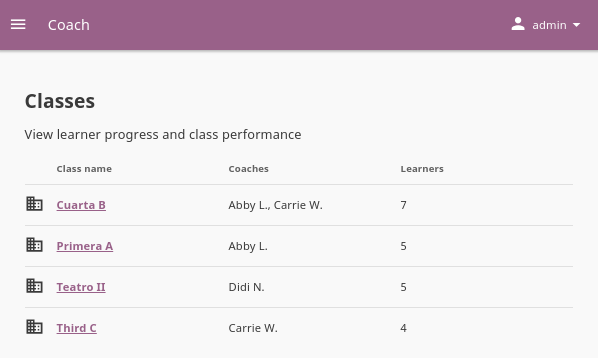
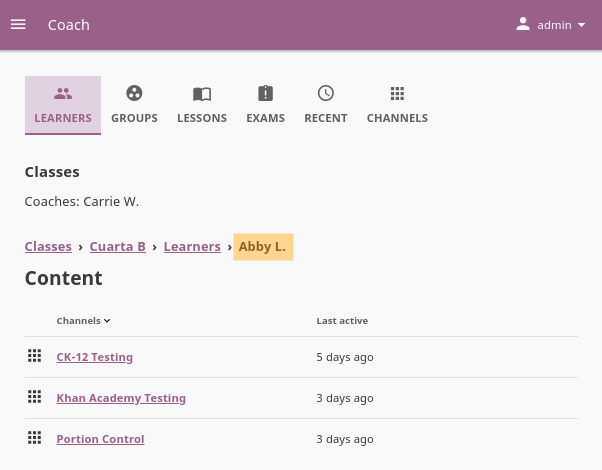
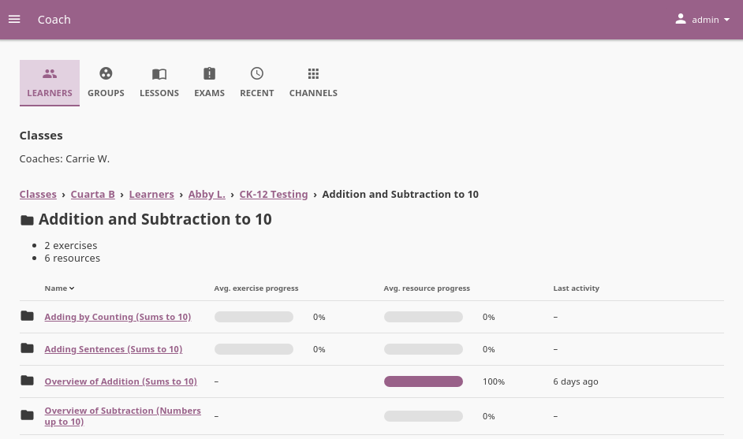
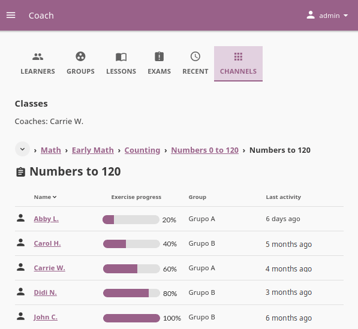

.. _coach:

Coach your Learners in Kolibri
##############################
 
You can track progress of the **Learners**, create and assign **Lessons** and **Exams** to classes or learner groups from the **Coach** dashboard. The default view of the **Coach** dashboard presents the list of **Classes** with their assigned coaches, and the number of learners enrolled in each class.

Click on a class to access the progress-tracking features and create lessons and exams.

.. _track_progress:

View Learner Reports
~~~~~~~~~~~~~~~~~~~~

Click a class on the **Coach** dashboard to display the list of enrolled learners, and the group they are assigned to (if applicable).

When you click the username of a learner, you will see a list of content channels they accessed, and the last time they were active on each of them:

  Learner Reports present a quick view of all the content accessed by a learner.

.. note::
  In a Learner report, the username of the selected learner will be the last item in the breadcrumb navigation menu.

Navigate the topic tree of each channel to see the progress of the selected learner for the topics, subtopics and individual resources. As you navigate, you will see topics added to the breadcrumbs menu.

In the image below, you can see that the learner **Abby L.** accessed and completed only one of the subtopics from the topic **Addition and Subtraction to 10**: 

  Learner Reports across topics for the selected content channel.

.. _exercise_progress:

Review Exercise Progress
------------------------

When a learner answers exercise questions in Kolibri, the progress bar below the exercise is taking into account only the most recent given answers, meaning that the learner must complete the required number of correct answers (*check marks*) **in the row** for the exercise to be considered completed.

	.. figure:: img/correct-row.png
	    :alt: If the exercise requires 5 check marks, learner must provide 5 correct answers one after another.

	    The correct answers in the image above are not in a row; this exercise will be completed only after the learner gives 5 correct answers one after another.

In the example below, the progress bar for the exercise **Subtract within 5** will appear as 40%, because the student has given 2 correct answers within the most recent set of 5 attempts. For example: If this student had made 20 incorrect attempts before the 4 displayed attempts, those 20 incorrect attempts would not get factored into the progress bar.

	.. figure:: img/topic-view-detail.png
	    :alt: View average progress for a single exercise or resource in a topic.

Click the exercise title to see all the answers and attempts on each question. In the figure below, you can see the progress of the learner **Hansen** for the exercise **Numbers to 120**. The exercise is still **In progress** as the learner has not completed the 5 correct answers in the row. You can also see that for the *Question 13*, the learner has given the correct answer only on the 4th attempt, which indicates that they are still struggling with the given concept.

.. figure:: img/learner-exercise-attempts.png
    :alt: Details for answers and attempts of a single exercise.

    Details for answers and attempts on a single exercise.

How does it looks if learner A does 5 correct answers in a row on their first try, but learner B gets 10 wrong answers in a row before giving 5 correct ones in a row? In both cases, the progress would show as 100%, and you would have to click each learner's name to access their progress report and attempt history.

In the figure below, you can see the progress of 5 learners for the exercise **Numbers to 120** in ascending order.

    View the progress for a single exercise or resource in a topic.

.. include:: manage/_groups.rst

.. include:: manage/_lessons.rst

.. include:: manage/_exams.rst

.. _recent_view:

View Class Recent Activity
~~~~~~~~~~~~~~~~~~~~~~~~~~

Use this view to access the full report channels and items (exercises and resources - videos, reading material, etc.) accessed during the last 7 days by learners of the selected class.

	.. image:: img/coach-recent.png
	  :alt: coach recent activity

If the class learners have access to more than one channel, you will see the list of channels firstly. From there, you can navigate by topics and subtopics until you arrive to a specific item. In the item's view, you can review the progress of each learner in the class that accessed the item.

.. _topic_view:

View Class Activity by Channels
~~~~~~~~~~~~~~~~~~~~~~~~~~~~~~~

Use this view to access the full report of activity progress for the selected class. You can navigate channels by topics and subtopics until you see the progress of each class learner for a specific item.

	.. figure:: img/topic-activity.png
	  :alt: Use the topic view to see the average progress for exercises and resources for all the learners in the class.

	  Use the channel view to see the average progress for exercises and resources for all the learners in the class.

When you navigate to the last level in the topic tree, you can see the average progress of all class learners for each exercise or resource (video, document, HTML5 activity) in that particular topic.
