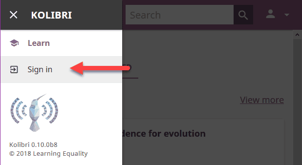
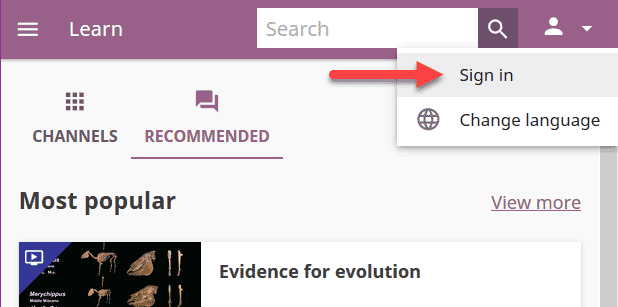
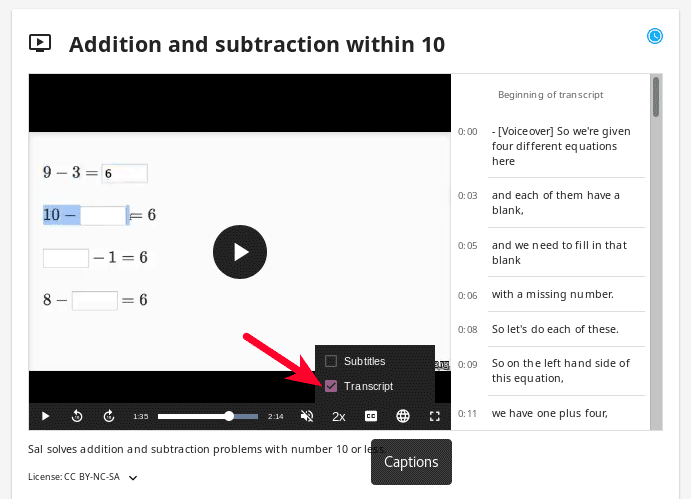

.. _learn:

Learn with Kolibri
##################

.. _access_learner:

Access Kolibri
==============

.. note::
  	* If you are using Kolibri in your school, education center or facility, your coach or administrator will provide the instructions how to open the sign-in page, and username and password if necessary.
  	* If you are using Kolibri on your own, outside an education center or facility, follow the instructions how to :doc:`access/index` according to your operating system.
  	* If you don't have an account, but Kolibri at your facility or home is set up to allow learners to create their own, follow the steps to :ref:`create one for yourself <create_account>`. 

Sign in to Kolibri
^^^^^^^^^^^^^^^^^^

To sign in to **Kolibri** and start learning, follow these steps:

#. Type your username and password (may be optional).
#. Click the :guilabel:`SIGN IN` button.

	.. figure:: img/login-modal.png
	  :alt: Input your username and password (if required) on the main sign in page.

	  Main Kolibri sign in page.

.. _sign_in_page:

.. warning::
   If you start browsing Kolibri as a guest, you need either to select **Sign in** option from the **Guest** menu in the upper right corner, or from the sidebar menu (left or bottom) to open the sign-in page.

  "Sign in" link in the sidebar.

  "Sign in" link in the user menu.

Once you have signed in to Kolibri, you can see and edit your user data from the **Profile** option: access it from the main sidebar menu (below **Learn**), or from the user menu.

	.. figure:: img/update-profile.png
	  :alt: 

.. note::
   If your account has been created prior to version 0.13 of Kolibri, you will see a notification that you can update your profile to provide your birth year and gender. This information is optional, and you can choose not to provide it. 

   * Click the *Usage and privacy* link to read more information about who will have access to your personal information.
   * Click the :guilabel:`UPDATE` button if you choose to provide it.

   .. figure:: img/update-profile2.png
	  :alt: 

To sign out from Kolibri you can either:
	* Click the user icon in the upper right corner and select **Sign out** option, **OR**
	* Select **Sign out** option in the main sidebar menu.

.. _create_account:

Create an account
^^^^^^^^^^^^^^^^^

To create your own account on a **Kolibri** facility and start learning, follow these steps:

#. Click the :guilabel:`CREATE AN ACCOUNT` button on :ref:`Kolibri sign in page <sign_in_page>`. 
#. Type in your chosen username and password (twice).
#. Click the *Usage and privacy* link to read more information about who will have access to your personal information.
#. Click the :guilabel:`CONTINUE` button.
#. Select your birth year and gender. This information is optional, and you can choose not to provide it.
#. Click the :guilabel:`FINISH` button.

When page reloads you will see the Learn page with Kolibri channels.

	.. tip::
	  Make sure to remember your username and password, or save them in a safe place!

Learn with Kolibri
==================

Classes
^^^^^^^

Each time you login into **Kolibri**, the first thing you will see is the **Learn** page with the list of all the classes you are enrolled to. 

	.. figure:: img/learn-classes.png
	  :alt: 

Select one of your classes to access :ref:`Lessons` and :ref:`Quizzes` teachers or coaches prepared for your class.

	.. figure:: img/exams-lessons.png
	  :alt: In each class you are enrolled to you may find one or more lessons and quizzes.

Channels
^^^^^^^^

Use this tab (|channels| icon) to navigate through the complete set of learning topics and materials available in Kolibri. You can browse it as you wish, or according to indications from your teachers and coaches.

Depending on how your school and teachers or coaches decided to organize the content, you may have one or more channels available here. Follow the indications by your teachers or coaches on how to use the content from each available channel.

	.. figure:: img/channels.png
	  :alt: 

Recommended
^^^^^^^^^^^

In this tab (|recommended| icon) you can see various sections:

* **Most popular** displays the most frequently used materials in your school or facility.
* **Next steps** indicate the recommended materials based on those that you already viewed and interacted with.
* **Resume** displays activities that you started but haven't finished yet.

These learning topics and materials are either related to what you were doing the last time you used Kolibri. or recommended by your teachers and coaches.

The number of displayed content items in each row will depend on the width of your display, and you can browse with the |arrow-left| and |arrow-right| icons at the beginning and the end of the section rows.

	.. figure:: img/learn.png
		:alt: 

.. note::
   **Next steps** and **Resume** are not visible if you are browsing as a guest.

Navigate Kolibri topics with breadcrumb links
"""""""""""""""""""""""""""""""""""""""""""""

When you are browsing a topic in Kolibri, the **Breadcrumb** links indicate previously visited, more general topics. Current topic is at the last position, and you can click any of the previous links in the breadcrumb to go back to a specific broader topic.

	.. figure:: img/breadcrumbs.png
		:alt: 

If the full length of the breadcrumbs becomes too wide for the width of your display, the more general topics will be hidden. Click the leftmost down arrow button to access them.

	.. figure:: img/breadcrumbs-folded.png
		:alt: Click the expand more button to reveal folded breadcrumb links.

Search
^^^^^^

If you are looking for a specific subject, topic, or term, use the **Search** feature:

#. Type the word or combination of words you are looking for in the search field located in the top bar.
#. Press :guilabel:`Enter` or click the |search| button to display the results.
#. Filter the search results by channel or type of content.

	.. figure:: img/search.png
		:alt: Use the select controls to filter the results by channel or type.

Some Kolibri resources may be duplicated in different topics and/or channels. Search results will indicate when a resource is duplicated, and you can click on the ``...locations`` link to discover the details for each location.

	.. figure:: img/search-duplicates.png
		:alt: 

	.. figure:: img/search-duplicates2.png
		:alt: Details for the duplicated resources in the search results will open in a new dialog window; use the links to explore or close the dialog to return to the search results.

		Details for the duplicated resources in the search results.

.. _content_types:

Content types
^^^^^^^^^^^^^

You may see different types of content available in Kolibri channels, and you can easily distinguish them by their icons:

* Videos - |video-icon|
* Exercises - |exercise-icon|
* Documents - |doc-icon|
* Interactive HTML Apps - |html-icon|
* Topics - |topic-icon|
* Slideshow - |slideshow-icon|

When you start doing an exercise, viewing a video, or reading a document, it will be marked with the |in-progress| icon. Once you finish viewing a video or complete the exercise, they will be marked with the |completed| icon.

	.. figure:: img/progress-icons.png
		:alt: Progress status for each learning material will be indicated together with their title.

		Progress indicator icons for learning resources.

Exercises
"""""""""

Kolibri **Exercises** can require you to do different things: fill in a missing number, write a formula, choose one of the available options, etc. Each correct answer gets you a check mark, and majority of exercises require 5 correct answers in a row to be completed. Some exercises can offer one or more hints, to help you solve the problem.

Independent of the required action (writing an answer yourself or choosing one of the options), these are the steps to follow.

#. **Read the question carefully**.
#. Write the answer or choose one of the provided options.
#. When you are ready to submit, click the :guilabel:`CHECK` button.

   * When the answer is correct and a |green-check| icon appears in the progress bar below the exercise, click the :guilabel:`NEXT` button to proceed.
   * If the answer is incorrect, read the question again, and try another answer. You can also click the :guilabel:`USE A HINT` link, read the suggestions, and try to answer again.
   * The progress bar below the exercise is taking into account only the most recent answers you give, which means that you need to have the required number of |green-check| icons **in the row** for the exercise to be considered completed.

    .. figure:: img/get-5-correct.png
	    :alt: If the exercise requires 5 green check marks, you must provide 5 correct answers one after another.

	    The correct answers in the image above are not in a row; this exercise will be completed only after you give 5 correct answers one after another.

#. Once you have achieved the required number of correct answers in a row, you will be rewarded points, and see the suggestion to continue. Click the card under the **Next resource** heading below to continue learning with the rest of the material in that topic.
#. If you are unable to solve some questions, try reviewing the videos in that same topic, or seek help from your peers or teacher/coach.

Video and Audio Player options
""""""""""""""""""""""""""""""

To play videos and listen to audio files in Kolibri you have several available control buttons at the bottom of the player screen. Move the cursor or tap on the player screen to make appear the control buttons while playing.

	.. figure:: img/video.png
		:alt: 

		Kolibri video and audio player.

(controls at the bottom of the player)

* Play/Pause buttons
* Rewind/Fast forward buttons by +/- 10 seconds
* Time tracker indicator with progress bar
* Video duration indicator
* Volume scrollbar
* Playback speed selector
* Display **closed captions** (subtitles) 
* Fullscreen button

Use the :guilabel:`DOWNLOAD CONTENT` button below the player to download the video, audio and thumbnail files to your computer. Some videos will provide multiple resolution options.

Interactive Video Transcript
****************************

When a video has captions available, you can choose to view them at the bottom of the player, or open them as an interactive transcript. 

#. Click the :guilabel:`CC` button at the bottom of the player and select **Transcript**.
#. Scroll up and down the transcript and click on the chosen timestamp to navigate more easily between various video sections. 
   

	Kolibri allows you to navigate videos using the captions inside the transcript.	

PDF Viewer options
""""""""""""""""""

.. note::
  Options for viewing PDF files will depend on the browser and operating system you are using to view Kolibri.

* Use the |fullscreen| button in the upper right corner to open the ebook in fullscreen view.
* With the :guilabel:`+` and :guilabel:`-` buttons you can zoom the document in and out.
* Use the :guilabel:`Esc` key to close the fullscreen view and return.
* Use the :guilabel:`DOWNLOAD CONTENT` button below the PDF viewer to download the PDF file to your computer.

	.. figure:: img/pdf.png
		:alt: 

Ebook Viewer options
""""""""""""""""""""

To read digital books in Kolibri you have several available controls inside the reader.

* Use the |toc| button in the upper left corner to view the table of content with all the book chapters.
* Click the |epub-settings| button to adjust the text size and the background color. 
* If you want to search for a word or a phrase, use the |search| button.
* Use the |fullscreen| button in the upper right corner to open the ebook in fullscreen view.
* Close the fullscreen view with the :guilabel:`Esc` key.
* Navigate through the book pages with |previous-page| and |next-page| buttons, or with the slider control at the bottom.
* Use the :guilabel:`DOWNLOAD CONTENT` button below the viewer to download the ePub file to your computer.

	.. figure:: img/epub.*
		:alt: 

Slideshow Viewer options
""""""""""""""""""""""""

To navigate the slides of a slideshow, you may use the on-screen navigation controls or your keyboard's arrow keys.

* Use the |fullscreen| button in the upper right corner to open the ebook in fullscreen view.
* Navigate the slides with the left arrow (←) or the right arrow (→) keys on your keyboard, or the |previous-page| and |next-page| buttons on the side of the slideshow.
* You can choose a specific slide by clicking the round icons at the bottom of the slideshow view. 

.. _lessons:

Lessons
^^^^^^^

Your teacher or coach may prepare a *lesson* (|lessons| icon), a recommended set of learning materials for you or your class to view. You may have more than one lesson available at the time in the **Classes** tab, below the **Lessons** heading. 

Click on a lesson title to open its content, and follow the indications of your teachers or coaches on how to use it.

	.. figure:: img/learner-lesson-home.png
		:alt: 

.. _quizzes:

Quizzes 
^^^^^^^

If your teacher or coach scheduled an *quiz* (|exams| icon) for you or your class, it will be available in the **Classes** tab, under the **Quizzes** heading. You may have more than one quiz available at the time.

	.. figure:: img/exams3.png
		:alt: 

If the quiz is listed as *Not started*, follow these steps.

#. Click on the quiz when you are ready to start taking it.
#. You can go on answering the questions in the order you prefer: move through questions with :guilabel:`PREVIOUS` and :guilabel:`NEXT` buttons, or click on the question number in the column on the left side.

	.. figure:: img/exam-detail.png
		:alt: 

#. Each time you fill in the answer field, or select one of the available options, the question will be marked by a colored dot in the column on the left side.
#. You can review and correct your answers to all questions as many times you need before submitting.
#. Press the *Back to quiz list* if you want to pause the quiz and come back later. 
#. Press the button :guilabel:`SUBMIT QUIZ` when you want to submit it for grading. 

A quiz that you did not yet submit will be marked with the |in-progress| icon, so you can easily recognize it, and click to resume when you are ready.

Once you complete and submit a quiz, it will be marked with the |completed| icon, but you can still click on it to see the score and review your answers.

	.. figure:: img/exam-result.png
		:alt:  

.. tip::
   Use the **Show correct answer** checkbox to visualize the answer for the questions that you did not answer correctly.
