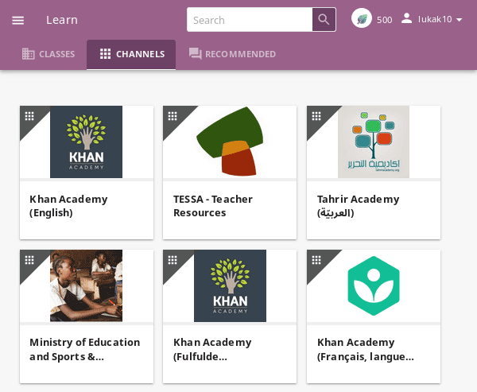

.. _learn:

Learn with Kolibri
##################

.. _access_learner:

Access Kolibri
==============

.. note::
  	* If you are using Kolibri in your school, education center or facility, your coach or administrator will provide the instructions how to open the sign-in page, and username and password if necessary.
  	* If you are using Kolibri on your own, outside an education center or facility, follow the instructions how to :doc:`access` according to your operating system.

To sign in to **Kolibri** and start learning, follow these steps:

#. Type your username and password (may be optional).
#. Click the **SIGN IN** button.

	.. figure:: img/login-modal.jpg
	   :alt: Main sign in page.

	   Main sign in page.

.. warning::
   If you start browsing Kolibri as a guest, you need either to select **Sign in** option from the **Guest** menu in the upper right corner, or from the sidebar menu (left or bottom) to open the sign-in page.

	.. figure:: img/learn-page-signin.png
		:alt: "Sign in" link in the sidebar.

		"Sign in" link in the sidebar.

	.. figure:: img/learn-page-signin2.png
	    :alt: "Sign in" link in the user menu.

	    "Sign in" link in the user menu.

Once you have logged in into Kolibri, you can see and edit your user data from the **Profile** option in the main sidebar menu (below **Learn**).

	.. figure:: img/update-profile.png
		:alt: View and edit your user profile.

		View and edit your user profile.

To sign out from Kolibri you can either:
	* Click the user icon in the upper right corner and select **Sign out** option, **OR**
	* Select **Sign out** option in the main sidebar menu.

Learn with Kolibri
==================

Classes
^^^^^^^

Each time you login into **Kolibri**, the first thing you will see is the **Learn** page with the list of all the classes you are enrolled to. 

	.. figure:: img/learn-classes.png
		:alt: Learn start page with all your classes.

		Learn start page with all your classes.

Select one of your classes to access :ref:`Lessons` and :ref:`Exams` teachers or coaches prepared for your class.

	.. figure:: img/exams-lessons.png
		:alt: You can see all your lessons and exams in the Class tab.

		You can see all your lessons and exams in the Class tab.

Channels
^^^^^^^^

Use this tab (|channels| icon) to navigate through the complete set of learning topics and materials available in Kolibri. You can browse it as you wish, or according to indications from your teachers and coaches.

Depending on how your school and teachers or coaches decided to organize the content, you may have one or more channels available here. Follow the indications by your teachers or coaches on how to use the content from each available channel.

	Content in Kolibri is grouped in channels.

Recommended
^^^^^^^^^^^

In this tab (|recommended| icon) you can see various sections:

* **Most popular** displays the most frequently used materials in your school or facility.
* **Next steps** displays suggestions according to  topics and materials you previously visited.
* **Resume** displays activities that you started but haven't finished yet.

These learning topics and materials are either related to what you were doing the last time you used Kolibri. or recommended by your teachers and coaches.

.. note::
   **Next steps** and **Resume** are not visible if you are browsing as a guest.

The number of displayed content items in each row will depend on the width of your display, and you can browse with the |arrow-left| and |arrow-right| icons at the beginning and the end of the section rows.

	.. figure:: img/learn.png
		:alt: Learn page gives you access to all Kolibri learning content and activities.

		Learn page gives you access to all Kolibri learning content and activities.

Navigate Kolibri topics with breadcrumb links
"""""""""""""""""""""""""""""""""""""""""""""

When you are browsing a topic in Kolibri, the **Breadcrumb** links indicate previously visited, more general topics. Current topic is at the last position, and you can click any of the previous links in the breadcrumb to go back to a specific broader topic.

.. figure:: img/breadcrumbs.png
	:alt: Use breadcrumbs links to navigate back through Kolibri topics.

	Use breadcrumbs links to navigate back through Kolibri topics.

If the full length of the breadcrumbs becomes too wide for the width of your display, the more general topics will be hidden. Click the leftmost down arrow icon to access them.

.. figure:: img/breadcrumbs-folded.png
	:alt: click the expand more button to reveal folded breadcrumb links

Search
^^^^^^

If you are looking for a specific subject, topic, or term, use the **Search** feature:

#. Type the word or combination of words you are looking for in the search field located in the top bar.
#. Press **Enter** or click the |search| button to display the results.

.. figure:: img/search.png
	:alt: Filter the search results by channel or type of content.

	Filter the search results by channel or type of content.

Some Kolibri resources may be duplicated in different topics and/or channels. Search results will indicate when a resource is duplicated, and you can click on the ``...locations`` link to discover the details for each location.

.. figure:: img/search-duplicates.png
	:alt: Duplicated resources in the search results.

	Duplicated resources in the search results.

.. figure:: img/search-duplicates2.png
	:alt: Details for the duplicated resources in the search results.

	Details for the duplicated resources in the search results.

.. _content_types:

Content types
^^^^^^^^^^^^^

You may see different types of content available in Kolibri channels, and you can easily distinguish them by their icons:

* Videos - |video-icon|
* Exercises - |exercise-icon|
* Documents - |doc-icon|
* Interactive HTML Apps - |html-icon|
* Topics - |topic-icon|

When you start doing an exercise, viewing a video, or reading a document, it will be marked with the |in-progress| icon. Once you finish viewing a video or complete the exercise, they will be marked with the |completed| icon.

.. figure:: img/progress-icons.png
	:alt: Progress indicators for learning resources.

	Progress indicators for learning resources.

Exercises
"""""""""

Kolibri **Exercises** can require you to do different things: fill in a missing number, write a formula, choose one of the available options, etc. Each correct answer gets you a check mark, and majority of exercises require 5 correct answers in a row to be completed. Some exercises can offer one or more hints, to help you solve the problem.

Independent of the required action (writing an answer yourself or choosing one of the options), these are the steps to follow.

#. **Read the question carefully**.
#. Write the answer or choose one of the provided options.
#. When you are ready to submit, click the **Check** button.

   * When the answer is correct and a |green-check| icon appears in the progress bar below the exercise, click the **Next** button to proceed.
   * If the answer is incorrect, read the question again, and try another answer. You can also click the **Use a hint** button, read the suggestions, and try to answer again.
   * The progress bar below the exercise is taking into account only the most recent answers you give, which means that you need to have the required number of |green-check| icons **in the row** for the exercise to be considered completed.

    .. figure:: img/get-5-correct.png
	    :alt: If the exercise requires 5 check marks, you must provide 5 correct answers one after another.

	    The correct answers in the image above are not in a row; this exercise will be completed only after you give 5 correct answers one after another.

#. Once you have achieved the required number of correct answers in a row, you will be rewarded points, and see the suggestion to continue. Click the **Next resource** below to continue learning with the rest of the material in that topic.
#. If you are unable to solve some questions, try reviewing the videos in that same topic, or seek help from your peers or teacher/coach.

.. figure:: img/exercise.png
	:alt: exercise page

	Exercise page in Kolibri.

Video and Audio Player options
""""""""""""""""""""""""""""""

To play videos and listen to audio files in Kolibri you have several available control buttons at the bottom of the player screen. Move the cursor or tap on the player screen to make appear the control buttons while playing.

.. figure:: img/video.png
	:alt: video player

	Kolibri video and audio player.

(controls at the bottom of the player)

* Play/Pause buttons
* Rewind/Fast forward buttons by +/- 10 seconds
* Time tracker indicator with progress bar
* Video duration indicator
* Volume scrollbar
* Playback speed selector
* Display **closed captions** (subtitles) 
* Fullscreen button

Use the **Download content** button below the player to download the video, audio and thumbnail files to your computer. Some videos will provide multiple resolution options.

PDF Viewer options
""""""""""""""""""

.. note::
  Options for viewing PDF files will depend on the browser and operating system you are using to view Kolibri.

* Use the **Enter fullscreen** button to open the PDF file in fullscreen view.
* Use the **Esc** key to close the fullscreen view and return.

.. figure:: img/pdf.png
	:alt: pdf page

Use the **Download content** button below the PDF viewer to download the PDF file to your computer.

Ebook Viewer options
""""""""""""""""""""

To read digital books in Kolibri you have several available controls at the top and bottom of the viewer.

* **Table of content** button in the upper left corner allows you to view the book chapters
* Open the **Settings** to adjust the text size and the background color 
* If you want to search for a word or a phrase, use the **magnifying glass** button
* Use the **Enter fullscreen** button in the upper right corner to open the ebook in fullscreen view.
* Use the **Esc** key to close the fullscreen view and return.

.. figure:: img/epub.gif
	:alt: pdf page

Use the **Download content** button below the viewer to download the ePub file to your computer.

.. _lessons:

Lessons
^^^^^^^

Your teacher or coach may prepare a *lesson* (|lessons| icon), a recommended set of learning resources for you or your class to view. You may have more than one lesson available at the time in the **Class** tab, below the **Lessons** heading. 

Click on a lesson title to open its content, and follow the indications of your teachers or coaches on how to use it.

.. figure:: img/learner-lesson-home.png
	:alt: lessons tab

.. _exams:

Exams 
^^^^^

If your teacher or coach scheduled an *exam* (|exams| icon) for you or your class, it will be available in the **Class** tab, under the **Exams** heading. You may have more than one exam available at the time.

.. figure:: img/exams3.png
	:alt: exams tab

If the exam is listed as *Not started*, follow these steps.

#. Click on the exam when you are ready to start taking it.
#. You can go on answering the questions in the order you prefer: move through questions with **Previous** and **Next question** buttons, or click on the question number in the column on the left side.

	.. figure:: img/exam-detail.png
		:alt: Exam page

#. Each time you fill in the answer field, or select one of the available options, the question will be marked by a colored dot in the column on the left side.
#. You can review and correct your answers to all questions as many times you need before submitting.
#. Press the *Back to exam list* if you want to pause the exam and come back later. 
#. Press the button **Submit exam** when you want to submit it for grading. 

Exam that you did not yet submit will be marked with the |in-progress| icon, so you can easily recognize it, and click to resume when you are ready.

Once you complete and submit an exam, it will be marked with the |completed| icon, but you can still click on it to see the score and review your answers.

.. figure:: img/exam-result.png
	:alt: Open the completed result to review your answers.

	Open the completed result to review your answers.

.. tip::
   Use the **Show correct answer** checkbox to visualize the answer for the questions that you did not answer correctly.
