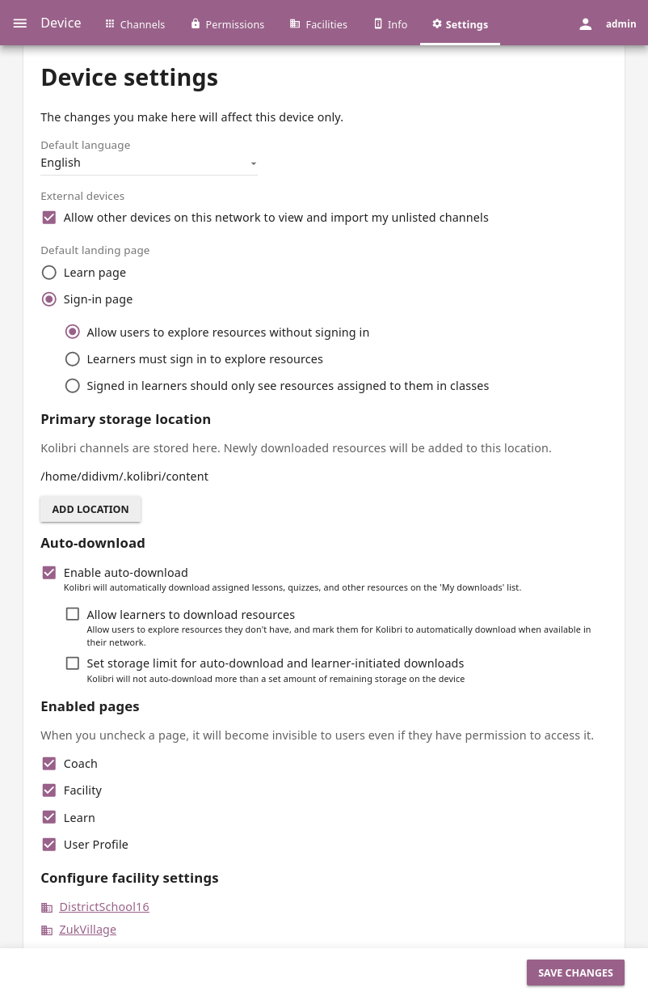

.. _manage_device_ref:

Device
######

You can edit device configuration settings in Kolibri from the **Settings** tab in your **Device** dashboard (|settings| icon). Remember that you can also configure :ref:`manage_facility_ref` settings. 

.. note::
  To manage device settings you must have the appropriate permissions.

	Configure device settings.

Whenever you change any of the device options, be sure to click the :guilabel:`SAVE` button to apply the changes.

Set Default Language
--------------------

The language you have chosen during the :ref:`setup_initial` will be set as the **default language** for all users who access Kolibri on the server device.

If you want to select a different default language, use the drop-down menu. You can set Kolibri to display in the language defined by the browser content settings, or in any of the :ref:`currently supported languages <languages>`.

.. note::
  All users will still be able to :ref:`change to their own language of preference <change_language>` from the user menu options.

Allow Peer Import
-----------------

If you have imported resources from an unlisted channel on Kolibri Studio, but you do want to make them available for :ref:`import to other Kolibri server devices <local_network>` (*peers*) in your local network, you can allow it by checking the **Allow other computers on this network to import my unlisted channels** checkbox.

If you prefer to keep those resources available only from your own device, be sure to keep that option unchecked.

Set Default Landing Page
------------------------

You can configure the default landing page for learners to be the Kolibri **Sign-in page** or the **Learn** page. 

The first option is recommended when you want to encourage the learners to always start the session in Kolibri with their username (and password, if required) in order to retain the learning progress data. In this case you can also:

* Leave unchecked the **Allow users to access resources without signing in** checkbox, if you want to restrict guest browsing and allow learners to access Kolibri only if they sign-in.
* Check the **Learners should only see resources assigned to them in classes** checkbox if you don't want to allow free browsing of resources available on your device. In this case learners will only see the **Learn > Classes** tab with quizzes and lessons that they have been assigned when they sign-in to Kolibri, and the **Channels** and **Recommended** tabs will not be visible.
  
If your device is located in a less formal learning facility setting (like a library or a community center), where you are not tracking individual learning progress, or you want to encourage self-exploration of channels and resources available on Kolibri, use the **Learn** page as the default landing page. 
