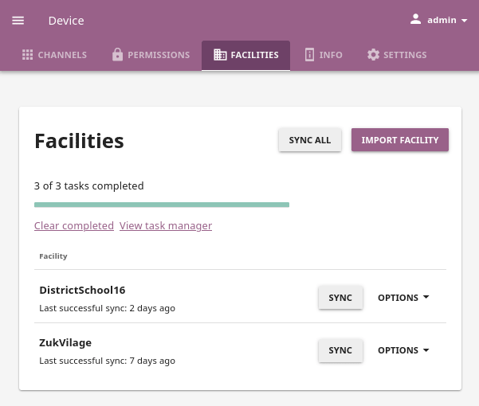

.. _facilities:

Facilities
##########

You can import, sync and remove the facilities on your Kolibri device from the **Facilities** tab in your **Device** dashboard ( icon). 

.. TO-DO (icon)

.. note::
  To manage facilities on the device you must have the **super admin** permissions.

	Manage the facilities on the device.

Import Facility
***************

If you are part of a wider learning environment, where your device is used to store the data from other facilities that are offline, you must import those facilities first. Once you have imported the facility on your device, you can periodically connect to their local network and sync the learner progress data.

To import a facility on your device, follow these steps.

#. Click the :guilabel:`Import facility` button. 

#. Any device that has Kolibri running in the local network should appear in the **Select network address** window.

	Select the device and click the :guilabel:`Continue` button.

  	.. figure:: /img/import-facility-select-device.png
	   :alt: 

	   Select the network address of the device from which you want to import a facility.

		.. note:: If you do not see the address of the device listed, but you know the IP address, you can add it manually. Click the *Add new address* link, and fill in the required information.

			.. figure:: /img/import-facility-add-device.png
				:alt: Add the network address of the device manually.

				Add the network address of the device manually.

#. **Select facility**. If there are several facilities on the source device, select the one you want to import. 

  	.. figure:: /img/select-facility-to-import.png
	   :alt: 

	   Select the facility you want to import.

#. **Enter admin credentials**. The credentials (username and password) you provide in this step must be either those for the **facility admin** of the facility you are importing, or for the **super admin** of the device you are importing from.

  	.. figure:: /img/import-facility-admin-creds.png
	   :alt: 

	   Enter admin credentials.

#. Wait for the importing facility task to complete. It may take some time, so please be patient. 
   
  	.. figure:: /img/import-facility-task.png
	   :alt: 

	   Facility is imported on your device.

#. When the import process is completed click the *Back to facilities* link and you will see the new facility on the list.

  	.. figure:: /img/new-imported-facility.png
	   :alt: 

	   List of the facilities on your device.

.. _sync_facility:

Sync Facility
*************

You can use the **Sync facility** feature for a variety of needs in both offline and online settings. 

.. warning:: When syncing data between devices in the local network **you must make sure that they have the same channels and resources**. If they do not have the same learning resources, coaches and learners will not be able to interact with lessons and quizzes correctly.

Examples of Syncing Scenarios
^^^^^^^^^^^^^^^^^^^^^^^^^^^^^

.. warning::
	**TO-DO**

	**Parking lot scenario**

	- A school with 50 students has one device for every learner and coach.
	- For a few hours every weekday, an admin is set up in a parking lot with a Kolibri server on a laptop and a strong local WiFi hotspot.
	- On Fridays, coaches come to the parking lot and retrieve their learners' progress data from the previous week and submit new lessons for the next week.
	- Monday through Thursday, learners or their guardians come to the parking lot to get the next week's lessons. During this time, coaches create lessons for the next week.
	- Coaches may use out-of-band channels such as WhatsApp to provide guidance to the learners throughout the week.

	**Roaming Kolibri server for data collection**

	- Non-profit organization supports 10 rural schools that have no internet connection.
	- All schools have a Kolibri device and a local WiFi hotspot powered by solar battery.
	- Each month someone from the supporting organization comes to offline schools with a *roaming* Kolibri server on a laptop with some updated channels and new resources from Kolibri Studio. They proceed to update the channels on the school device with new resources, and sync the school facility with an instance on the laptop to collect the data about learners' progress during the previous month.

To sync the classes, groups, learner progress and all the facility data with the device from where you imported it, follow these steps.

#. Click the :guilabel:`SYNC` button for the desired facility.
#. Any device that has Kolibri running in the local network should appear in the **Select network address** window. Select the network address of the device you want to sync with. 
#. Syncing process will start immediately and you will see the task progress bar in the **Facilities** page. When the import process is completed you can open the task manager and review the size of the sent and received data.
   
.. warning:: **Firewals** may impede your ability to see other devices in your local network, or add them as source. If you are unable to see other devices, make sure to:

	* disable the firewalls on all the devices that you need to sync
	* restart Kolibri for broadcast to take effect		

Sync with Kolibri Data Portal
^^^^^^^^^^^^^^^^^^^^^^^^^^^^^

If your Kolibri facility is part of a larger organization that tracks data on the **Kolibri Data Portal**, you can register and sync from **Facilities** page, same as from **Facility > Data** page.

#. Click the :guilabel:`OPTIONS` button and select the **Register** option, to :ref:`register your facility with the Kolibri Data Portal <sync_kdp>` (you must provide the project token). 
#. Click the :guilabel:`SYNC ALL` button to sync all registered facilities to the Kolibri Data Portal.
  

Remove Facility
***************

To remove a facility from the device, follow these steps.

#. Click the :guilabel:`OPTIONS` button on the right edge of the desired facility.
#. Select the **Remove** option.
#. Click the :guilabel:`REMOVE` button in the confirmation window to proceed, or :guilabel:`CANCEL` to exit.
   
  	.. figure:: /img/remove-facility.png
	   :alt: 

.. warning:: When you remove a facility you will loose all its data. However, if you previously synced it to another device or the Kolibri Data Portal, you should be able to load it again.